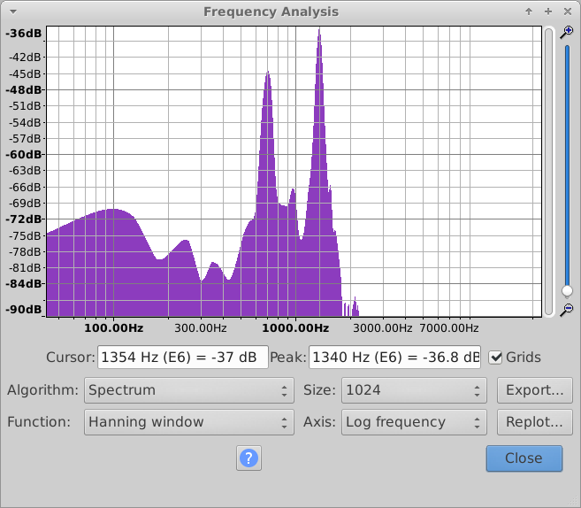

# Tone

> Tone (Forensic, Baby, 10 pts)
> Author: George Zaytsev (groke)
> 
> Ha! Looks like this guy forgot to turn off his video stream and entered his password on his phone!
> 
> youtu.be/11k0n7TOYeM

The challenge leads us to a YouTube video of someone behind a chair typing on a phone, and the tones generated by the phone can be heard. This tone system is called [DTMF](https://en.wikipedia.org/wiki/Dual-tone_multi-frequency_signaling). Each keypress produces a tone consisting of two simultaneous sinusoidal frequencies. Most keypresses are repeated a few times.

|        | 1209 Hz | 1336 Hz | 1477 Hz | 1633 Hz |
| ------ | :-----: | :-----: | :-----: | :-----: |
| 697 Hz |    1    |    2    |    3    |    A    |
| 770 Hz |    4    |    5    |    6    |    B    |
| 852 Hz |    7    |    8    |    9    |    C    |
| 941 Hz |    *    |    0    |    #    |    D    |

Identifying these tones simply by listening to them isn't easy (this skill is aptly called [ear training](https://en.wikipedia.org/wiki/Ear_training)), so let's get some help with identifying them.

First, let's save the audio into a file. The `-F` flag in `youtube-dl -F https://www.youtube.com/watch?v=11k0n7TOYeM` shows us the download options.

```
[youtube] 11k0n7TOYeM: Downloading webpage
[youtube] 11k0n7TOYeM: Downloading video info webpage
[youtube] 11k0n7TOYeM: Downloading MPD manifest
[info] Available formats for 11k0n7TOYeM:
format code  extension  resolution note
139          m4a        audio only DASH audio   49k , m4a_dash container, mp4a.40.5@ 48k (22050Hz)
251          webm       audio only DASH audio   85k , webm_dash container, opus @160k (48000Hz)
140          m4a        audio only DASH audio  130k , m4a_dash container, mp4a.40.2@128k (44100Hz)
278          webm       256x144    DASH video   95k , webm_dash container, vp9, 30fps, video only
160          mp4        256x144    DASH video  108k , mp4_dash container, avc1.4d400b, 30fps, video only
242          webm       426x240    DASH video  220k , webm_dash container, vp9, 30fps, video only
134          mp4        640x360    DASH video  227k , mp4_dash container, avc1.4d401e, 30fps, video only
133          mp4        426x240    DASH video  242k , mp4_dash container, avc1.4d400c, 30fps, video only
243          webm       640x360    DASH video  405k , webm_dash container, vp9, 30fps, video only
244          webm       854x480    DASH video  752k , webm_dash container, vp9, 30fps, video only
136          mp4        1280x720   DASH video  932k , mp4_dash container, avc1.4d401f, 30fps, video only
135          mp4        854x480    DASH video 1155k , mp4_dash container, avc1.4d4014, 30fps, video only
247          webm       1280x720   DASH video 1505k , webm_dash container, vp9, 30fps, video only
18           mp4        640x360    medium , avc1.42001E, mp4a.40.2@ 96k, 1.82MiB
43           webm       640x360    medium , vp8.0, vorbis@128k, 2.50MiB
22           mp4        1280x720   hd720 , avc1.64001F, mp4a.40.2@192k (best)
```

We only want the audio, so `140` is an appropriate choice.

We can open the `.m4a` file with [Audacity](https://sourceforge.net/projects/audacity/), the good old audio editor. Just go to _File_ > _Import_ > _Audio..._ and select the file. We can make the audio a bit louder by selecting the whole track (Ctrl+A) and choosing _Effect_ > _Amplify..._.

Now here's the trick: we want to identify the two simultaneous frequencies in each keypress. To do this, we select the keypress we want to identify and then we go to _Analyze_ > _Plot Spectrum..._.



This window shows the frequency analysis of the selected part of the audio. Because of noise and harmonics, other frequencies show up, but it's easy to see there are two peaks in the graph. By hovering the mouse near these peaks, we can see the frequency at the cursor position and the nearest peak frequency (1354 Hz and 1340 Hz in this image, respectively). We'll write down the peak frequencies of the two biggest peaks, which should be pretty close to the values in the table.

In the first keypress, the values are 699 Hz and 1340 Hz. The nearest values in the table are 697 Hz and 1336 Hz, which means the "2" key was pressed. It's easy to notice the same key is being pressed a few times (it's the same tone and there are longer gaps between other presses), so let's just write down how many times it was pressed and repeat this process for each group of keypresses.

In the end, you should have the following data:

`222 999 22 777 444 222 7777 7777 33 222 777 33 8 8 666 66 2 555 333 555 2 4`

If you've ever sent an SMS using a dumb phone, you probably know what to do already. Each sequence corresponds to a letter written in a telephone keypad, so 2 = A, 22 = B, 222 = C, 3 = D, 33 = E and so on. By decoding the data we have, we get the sequence `cybricssecrettonalflag`, which should be formatted as `cybrics{secrettonalflag}`.
